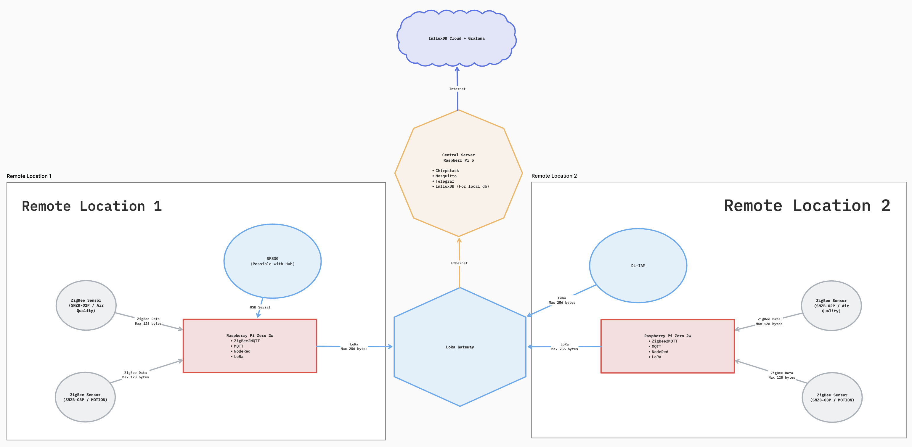
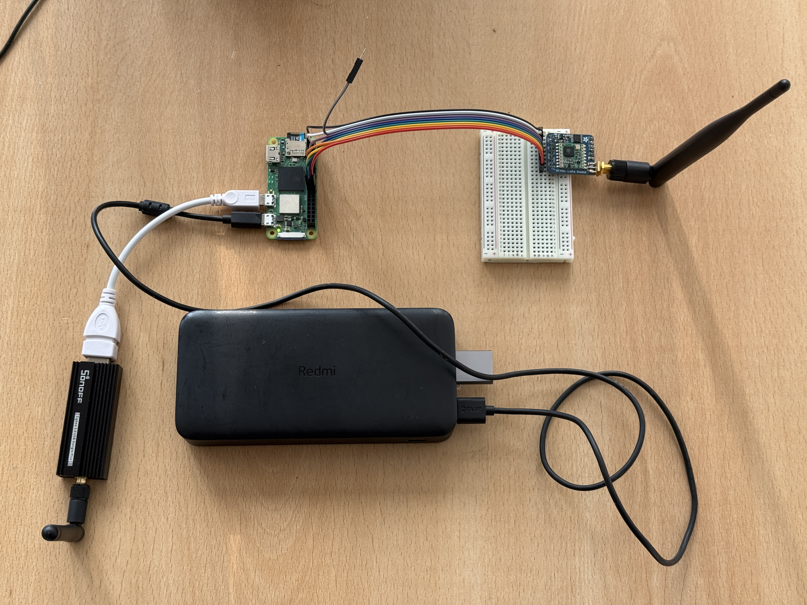
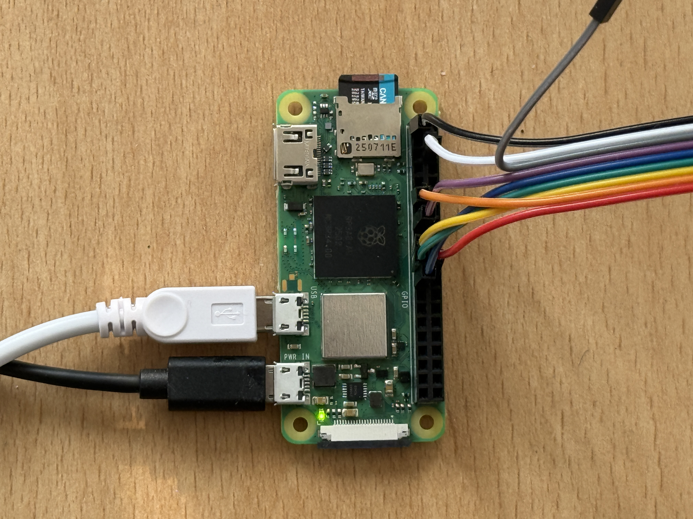
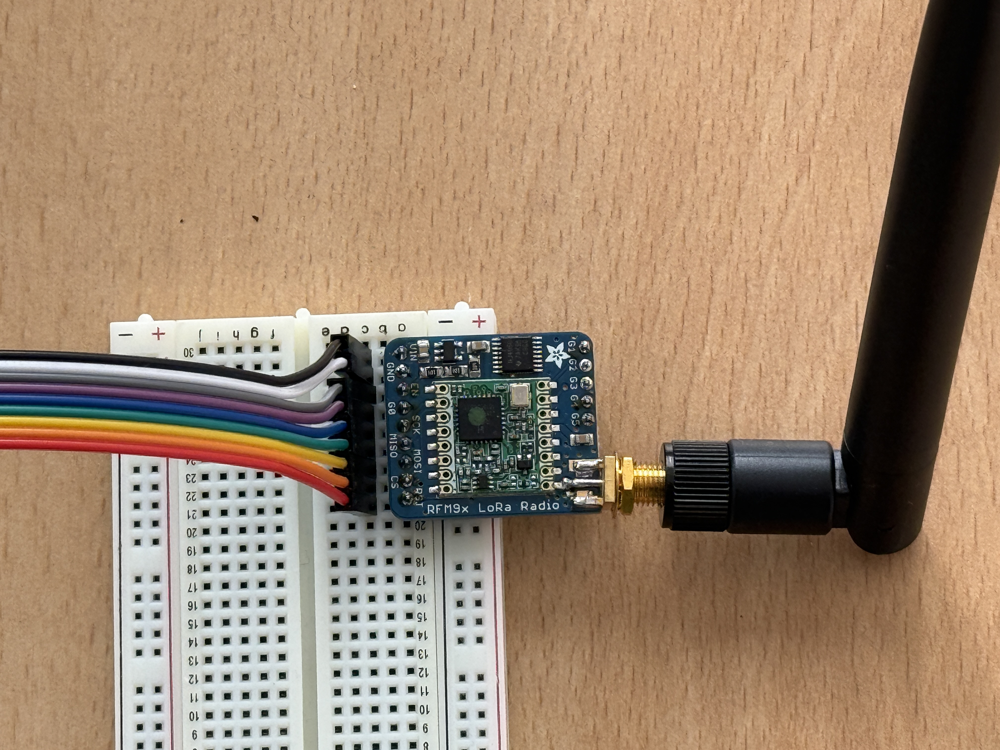

# LorBeePlugin

Run **Zigbee**, **MQTT**, and a **merged sensor snapshot** on a Raspberry Pi with **Docker**. **[DietPi](https://dietpi.com/)** is the usual OS; Raspberry Pi OS or another Debian-based OS also works. **LoRaWAN** (ChirpStack-style gateway in the cloud) is optional.

This repo is a **Docker Compose stack**, not a full operating system. **LorBeeOS** (separate project, in progress) will ship a **flashable Pi image** that bundles this stack for hands-off deployment; DIY installs use this repo on **DietPi** (or similar) + Docker.

### Where this fits (system architecture)

**LorBeePlugin** is the **remote / edge** piece: one **Raspberry Pi Zero 2W** (typical) per site runs **its own Zigbee mesh** (USB coordinator) and can uplink a merged sensor snapshot **over LoRaWAN** via an optional **SPI LoRa radio** (e.g. RFM9x). Many sites ⇒ many Pis, each with its own Zigbee network and its own LoRaWAN **end device** identity.

On the **central** side, a **LoRaWAN gateway** receives RF from those edges (and from **other LoRa sensors** on the same star) and forwards to **ChirpStack** (often on a “main” machine such as a **Raspberry Pi 5**). From there you route data to databases, dashboards, alerts, etc. A **future repository** is planned for that **central** stack (ChirpStack plus tooling such as Telegraf, InfluxDB, Grafana); **this repo does not install ChirpStack or the gateway**—it only prepares **one edge node**.



- **Diagram:** **[assets/architecture.png](assets/architecture.png)** (high-level picture of edge ↔ LoRaWAN ↔ gateway ↔ central PC).  
- **Narrative + component diagram:** **[docs/architecture.md](docs/architecture.md)**.  
- **ChirpStack:** each edge Pi with LoRa must be registered as its **own device** (unique **DevEUI** / keys). Create the device in ChirpStack, then copy **`LORAWAN_DEV_EUI`**, **`LORAWAN_APP_KEY`**, etc. into **`lora/chirpstack-node/keys.env`** on **that** Pi — **[lora/README.md](lora/README.md)**.  
- **SPI for LoRa on DietPi:** **[docs/dietpi-spi.md](docs/dietpi-spi.md)** (`dietpi-config` → Advanced Options → SPI).

---

## How to use this guide

| You are here | Start at |
|----------------|----------|
| **DietPi (or Debian) is already installed**, Docker maybe not | **[Install on the Pi (DietPi ready)](#install-on-the-pi-dietpi-ready)** |
| **Brand-new Pi Zero 2W + SD card**, nothing flashed yet | **[Appendix: From zero (new Pi + SD card)](#appendix-from-zero-new-pi-zero-2w--sd-card)** first, then the install section |

Most people skip the appendix and jump straight to **Install on the Pi**.

---

## What you get

| Service | What it does |
|---------|----------------|
| **Zigbee2MQTT** | USB Zigbee stick ↔ MQTT |
| **Mosquitto** | MQTT broker (port **1883**) |
| **Node-RED** | One combined sensor snapshot (file + MQTT + HTTP) |
| **LoRa (optional)** | Radio module on the Pi → LoRaWAN (see **`lora/README.md`**) |

**Web UIs:** Zigbee2MQTT **`http://<pi-ip>:8080`**, Node-RED **`http://<pi-ip>:1880`**. Snapshot JSON: **`http://<pi-ip>:1880/api/lorbee/v1/sensors`**.

---

## Reference hardware — Pi Zero 2W + RFM9x (test setup)

Photos below are from a **reference bench setup** (USB Zigbee coordinator + optional **RFM9x** LoRa module on **SPI0**). The wiring matches the **defaults** in this repo: **`lora/chirpstack-node/config.example.yaml`** uses **`spi_channel: 1`** (`/dev/spidev0.1`), **`cs: 17`**, **`dio0: 22`**, **`rst: 25`**. The LoRa section of **`bash scripts/setup-first-run.sh`** uses the same numbers. If your breakout uses other GPIOs, set **`RFM_SPI_CHANNEL`**, **`RFM_PIN_CS`**, **`RFM_PIN_DIO0`**, **`RFM_PIN_RST`** in **`lora/chirpstack-node/keys.env`** or edit **`config.yaml`** — see **[lora/README.md](lora/README.md)** (SPI **must** stay on **MOSI/MISO/SCK**; **CS** cannot be BCM **7** or **8**).

**Overview** — Pi Zero 2W with dongle and LoRa board:



**Close-ups** (same wiring as the table; Pi header ↔ module):

| Raspberry Pi Zero 2W (GPIO / SPI) | RFM9x breakout |
|:---:|:---:|
|  |  |

> [!IMPORTANT]
> Connect RFM9x **VIN** only to the Pi’s **3.3 V**. **Do not use 5 V** — it can damage the module.

### RFM9x ↔ Raspberry Pi Zero wiring

| RFM9x pin | Raspberry Pi Zero | Description |
|-----------|-------------------|-------------|
| **VIN** | **3.3 V** | Power (3.3 V only) |
| **GND** | **GND** | Ground |
| **G0** | **GPIO 22** (BCM 22) | DIO0 — interrupt to the CPU |
| **SCK** | **GPIO 11** (BCM 11) | SPI0 clock (SCLK) |
| **MISO** | **GPIO 9** (BCM 9) | SPI0 MISO |
| **MOSI** | **GPIO 10** (BCM 10) | SPI0 MOSI |
| **CS** | **GPIO 17** (BCM 17) | Chip select (bit-banged; not the kernel CE0/CE1 pins) |
| **RST** | **GPIO 25** (BCM 25) | Radio reset |

Enable **SPI** in **`dietpi-config`** before first boot of the stack with LoRa — **[docs/dietpi-spi.md](docs/dietpi-spi.md)**.

---

## Install on the Pi (DietPi ready)

Do these on the Pi (SSH or keyboard + monitor). You need **internet** and a user that can run **`docker`** (often after logging out and back in once Docker is installed).

### 1. Install Git and Docker (before cloning)

Install **Git** and **Docker** first—you need both before you clone this repository.

**Git**

- **Debian / Raspberry Pi OS (and DietPi):** `sudo apt update && sudo apt install -y git`
- **DietPi (software catalogue):** `sudo dietpi-software install 17` (Git client)

**Docker + Compose (both required)**

This stack uses **`docker compose`** (Compose **v2**, Docker CLI plugin). Engine alone is not enough.

- **DietPi:** **`sudo dietpi-software install 162`** (Docker), reboot if asked. Then **always** check:

```bash
docker compose version
```

If you see **`unknown command: docker compose`**, install the plugin (Docker CE from DietPi uses the same `apt` sources):

```bash
sudo apt update
sudo apt install -y docker-compose-plugin
docker compose version
```

If **`docker-compose-plugin`** is **not found**, Docker probably was not installed from Docker’s packages — use **[Docker Engine install for Debian](https://docs.docker.com/engine/install/debian/)** (ARM64 / ARMv7 per your Pi) so you get **`docker-ce`** and **`docker-compose-plugin`** from one place. Avoid relying on a bare **`docker.io`**-only install for this project.

- **Other Debian-based OS:** follow the same rule: Docker Engine **and** **`docker compose`** working before you clone.

Official overview: [DietPi Docker / Docker Compose](https://dietpi.com/docs/software/programming/#docker-compose).

Check:

```bash
git --version
docker --version
docker compose version
```

If you get “permission denied” for Docker, use `sudo docker …` once for tests, or add your user to the `docker` group (DietPi often does this when you install via `dietpi-software`) and **log out and SSH back in**.

**Make (optional)** — Minimal DietPi may not ship **`make`**. The docs below use **`bash scripts/…`** first so nothing extra is required. If you prefer shortcuts, install once: **`sudo apt update && sudo apt install -y make`**, then you can use **`make setup-first-run`**, **`make up-safe`**, etc.

### 2. Clone this repository

```bash
cd ~
git clone https://github.com/mjospovich/LorBeePlugin.git
cd LorBeePlugin
```

### 3. First-run setup (recommended)

Creates **`.env`**, sets **`NODE_RED_USER`**, **`TZ`**, **`EDGE_ID`**, optionally **`ZIGBEE_SERIAL_DEVICE`**, copies **`zigbee2mqtt/data/configuration.yaml`** from the example if missing, prompts for **Zigbee RF channel (11–26)** and optional **adapter type** (so nearby networks can avoid the same channel), creates snapshot / LoRa state directories, and **optionally** walks through **LoRa RFM9x** SPI **GPIO pins**, region, and uplink interval (written to **`lora/chirpstack-node/keys.env`**). You still edit **OTAA secrets** in **`keys.env`** by hand to match ChirpStack. Non-interactive: set **`LORBEE_ZIGBEE_CHANNEL`** / **`LORBEE_ZIGBEE_ADAPTER`** for the same YAML patches — see **`.env.example`**.

**Interactive** (menus and prompts):

```bash
bash scripts/setup-first-run.sh
```

Same thing, if you installed **`make`**: **`make setup-first-run`**.

**Non-interactive** (defaults only: current user for Node-RED, timezone from **`timedatectl`**, **`edge-<hostname>`**, Zigbee auto-detect if the stick is plugged in):

```bash
bash scripts/setup-first-run.sh --yes
```

**Non-interactive including LoRa** (default RFM wiring: SPI **1**, CS **17**, DIO0 **22**, RST **25**, region **EU868**; sets **`COMPOSE_PROFILES=lora`** — still edit **`lora/chirpstack-node/keys.env`** for OTAA secrets):

```bash
bash scripts/setup-first-run.sh --yes --with-lora
```

**Non-interactive Zigbee RF** (after **`configuration.yaml`** exists — e.g. same run created it from the example): set **`LORBEE_ZIGBEE_CHANNEL=11-26`** and optionally **`LORBEE_ZIGBEE_ADAPTER`** (`zstack`, `ember`, `deconz`, `zigate`) in the environment, e.g. `LORBEE_ZIGBEE_CHANNEL=20 bash scripts/setup-first-run.sh --yes`.

Advanced users can still **`cp .env.example .env`** and edit by hand — see **`.env.example`** and **`docs/configuration-map.md`**.

### 4. Zigbee2MQTT configuration file

The setup step copies **`zigbee2mqtt/data/configuration.yaml.example`** → **`configuration.yaml`** when the file does not exist yet. Edit **`zigbee2mqtt/data/configuration.yaml`** if MQTT settings, **`serial.adapter`**, or **`adapter_delay`** need tuning (MQTT on localhost; serial **`/dev/ttyUSB0`** *inside* the container; host path from **`.env`**). Adapter cheat sheet: **`docs/zigbee2mqtt.md`**.

### 5. Start the stack

**Recommended first start** (waits for the Zigbee USB device, then starts Mosquitto + Zigbee2MQTT + Node-RED):

```bash
bash scripts/stack-after-boot.sh
```

If you have **`make`**: **`make up-safe`** (same script).

**Alternative** if **`ZIGBEE_SERIAL_DEVICE`** in **`.env`** already points at a stable **`/dev/serial/by-id/...`** path:

```bash
bash scripts/ensure-data-dirs.sh
docker compose up -d
```

(Same as **make init** then **docker compose up -d** if you installed **make**.)

First image pull on a Pi Zero 2W can take several minutes.

Check:

```bash
docker compose ps
```

All main services should show **running** (or healthy). Logs:

```bash
docker compose logs -f zigbee2mqtt
```
(Press Ctrl+C to stop following.)

### 6. Pair Zigbee devices

Open **`http://<pi-ip>:8080`**, enable pairing in Zigbee2MQTT, add your sensors. Pairing and network data live on the Pi (**`zigbee2mqtt/data`** and the stick), not in git.

### 7. After a power cut (strongly recommended once)

So USB and the coordinator are ready before Zigbee2MQTT starts:

```bash
cd ~/LorBeePlugin   # your clone path
sudo bash scripts/install-zigbee-boot-timer.sh
```

Or: **`make install-boot-timer`** (same as the command above if **`make`** is installed). Then **reboot once** and check **`docs/pi-cold-boot.md`** for verification commands.

Without the timer, right after boot run **`bash scripts/stack-after-boot.sh`** (or **`make up-safe`**).

---

## Configuration cheat sheet

| Topic | Where |
|--------|--------|
| **What to edit for which feature** | **`docs/configuration-map.md`** |
| Stack paths, snapshot location | **`.env`**, **`docs/lorbeeos-paths.md`** |
| MQTT broker, Zigbee serial *inside* container, frontend | **`zigbee2mqtt/data/configuration.yaml`** |
| Cold boot, USB wait, optional LoRa on boot | **`.env`**, **`docs/pi-cold-boot.md`** |
| Node-RED flows / HTTP API | **`docs/nodered.md`** |
| Optional LoRa wiring, `keys.env`, ChirpStack (one device per edge Pi) | **`lora/README.md`**, **`docs/dietpi-spi.md`** (enable SPI on DietPi) |
| Big-picture architecture (edge vs central) | **`docs/architecture.md`**, **`assets/architecture.png`** |

---

## Useful commands

| Without `make` | With `make` (optional) | Purpose |
|----------------|-------------------------|---------|
| `bash scripts/setup-first-run.sh` | `make setup-first-run` | Interactive **`.env`** + Zigbee2MQTT template + data dirs |
| `bash scripts/ensure-data-dirs.sh` | `make init` | Create **`data/snapshot`**, **`data/lorawan-state`**, **`mosquitto/data`**, etc. |
| `docker compose up -d` | `make up` | Start stack (needs **`docker compose`** — see [Docker install](#1-install-git-and-docker-before-cloning)) |
| `docker compose down` | `make down` | Stop stack |
| `docker compose logs -f --tail 100` | `make logs` | Tail logs |
| `docker compose pull` | `make pull` | Pull images |
| `bash scripts/stack-after-boot.sh` | `make up-safe` | Wait for Zigbee USB, then start |
| `sudo bash scripts/install-zigbee-boot-timer.sh` | `sudo make install-boot-timer` | Install systemd boot helper |
| `docker compose build chirpstack-lora-node` then `docker compose --profile lora up -d chirpstack-lora-node` | `make lora-build` / `make lora-up` | Optional LoRa container |

---

## Troubleshooting

**`docker: unknown command: docker compose`** (or **`docker compose version`** fails)

- Install the **Compose v2 plugin**: **`sudo apt update && sudo apt install -y docker-compose-plugin`**, new shell, then **`docker compose version`**. If the package is missing, reinstall Docker from **[Docker’s Debian instructions](https://docs.docker.com/engine/install/debian/)** so Engine and Compose come from the same repository. See [Install → Docker](#1-install-git-and-docker-before-cloning).

**`make: command not found`**

- You do not need **`make`**. Use the **`bash scripts/…`** commands from [Useful commands](#useful-commands) (e.g. **`bash scripts/setup-first-run.sh`**). Or install: **`sudo apt update && sudo apt install -y make`**.

**Cannot open Zigbee2MQTT or Node-RED in the browser**

- Use the Pi’s **LAN IP** (`ip a` or your router’s DHCP list). DietPi default hostname is often **`DietPi`**.
- Confirm containers are up: `docker compose ps`.
- Same Wi‑Fi/LAN as the Pi; no extra firewall rule is required on a typical home LAN.

**`Failed to open serial port` / Zigbee never starts**

- Wrong or missing **`ZIGBEE_SERIAL_DEVICE`**: run **`bash scripts/setup-first-run.sh`** again with the stick plugged in, or `ls -la /dev/serial/by-id/` and set the full **`by-id`** path in **`.env`**, then restart Zigbee2MQTT.
- Start the stack with **`bash scripts/stack-after-boot.sh`** (waits for USB and resolves the device) instead of plain **`docker compose up`** when in doubt.
- Stick not plugged in or not enough USB power (try a powered hub on a Zero).
- After reboot, use **`bash scripts/stack-after-boot.sh`** or install the **boot timer** (step 7 above).

**Zigbee “worked until I rebooted”**

- Almost always **USB device name/order** or **startup timing**. Fix **`by-id`** path + boot timer. Long explanation: **`docs/zigbee2mqtt.md`** (cold boot section).

**Node-RED errors about permission / cannot write**

- Fix **`NODE_RED_USER`** to match `id -u`:`id -g` for the user that owns **`nodered/data`**. You may need `sudo chown -R $(id -u):$(id -g) nodered/data`.

**Docker: permission denied**

- `sudo usermod -aG docker $USER` then **log out and back in**, or use `sudo docker compose …` temporarily.

**LoRa does not join / no uplink**

- **SPI enabled?** On DietPi: **`docs/dietpi-spi.md`**. Then **`ls /dev/spidev0.*`** before blaming Docker.
- **ChirpStack:** this Pi must be a **separate OTAA device** with keys matching **`lora/chirpstack-node/keys.env`** (see **`lora/README.md`**).
- Ensure the **Zigbee + Node-RED** stack is up so **`data/snapshot/latest.json`** exists if you use packed payloads.

**Still stuck**

- `docker compose logs mosquitto`, `docker compose logs nodered`, `docker compose logs zigbee2mqtt`.
- **`docs/README.md`** indexes all service docs.

---

## Appendix: From zero (new Pi Zero 2W + SD card)

Use this if you have **hardware only** and need **DietPi on the card** first.

1. **Download DietPi** for **Raspberry Pi** (pick the image that matches **Pi Zero 2W** / ARM64 as listed on [dietpi.com](https://dietpi.com/)).
2. **Flash the SD card** with **[Raspberry Pi Imager](https://www.raspberrypi.com/software/)** (or Balena Etcher): choose the DietPi `.img`, select the SD drive, flash.
3. **First boot:** insert SD, power the Pi, wait for DietPi’s first-run setup (can take several minutes). Configure **Wi‑Fi** or Ethernet and **SSH** when the installer asks (or use Imager’s OS customisation to preset Wi‑Fi and SSH).
4. **SSH in** (e.g. `ssh root@dietpi` or `ssh dietpi@<ip>`—use whatever user DietPi showed on screen or your preset).
5. **Update, then install Git and Docker:** `sudo dietpi-update` if offered. Install **Git** if needed (`sudo apt install git` or `sudo dietpi-software install 17`). Install **Docker** with **`sudo dietpi-software install 162`** (DietPi-optimised), as in [Install on the Pi → step 1](#1-install-git-and-docker-before-cloning). Reboot if the installer asks.
6. Continue from **[Install on the Pi (DietPi ready)](#install-on-the-pi-dietpi-ready) → step 2** (clone the repo, then **first-run setup**).

**Pi Zero 2W note:** It is capable but light on RAM; first **`docker compose pull`** may be slow. Keep the official **USB data cable** and a **good power supply**; undervoltage causes random USB failures.

---

## More documentation

| Doc | Contents |
|-----|----------|
| **[docs/configuration-map.md](docs/configuration-map.md)** | Where each setting lives |
| **[docs/README.md](docs/README.md)** | Full index + port list |
| **[docs/pi-cold-boot.md](docs/pi-cold-boot.md)** | Boot timer, `.env` checklist, LoRa on boot |
| **[docs/docker-deployment.md](docs/docker-deployment.md)** | Why host networking, not DietPi-in-Docker |
| **[docs/zigbee2mqtt.md](docs/zigbee2mqtt.md)** | Serial, adapters, persistence, cold boot |
| **[docs/architecture.md](docs/architecture.md)** | Edge vs central, data flow, **`assets/architecture.png`** |
| **[docs/dietpi-spi.md](docs/dietpi-spi.md)** | Enable SPI on DietPi for LoRa |

Stack vs image: **[SOURCE.md](SOURCE.md)** (LorBeePlugin vs LorBeeOS).

## License

See [LICENSE](LICENSE).
