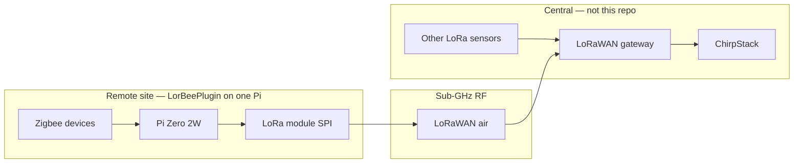
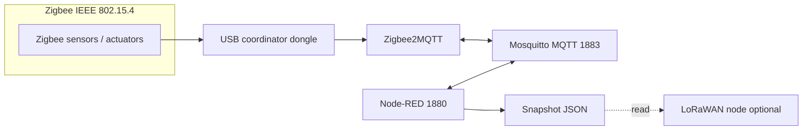

# LorBeePlugin — system architecture

## Edge vs central (what this repository is)

**LorBeePlugin** is the **Docker Compose stack for one remote edge node** — typically a **Raspberry Pi Zero 2W** with **DietPi**, a **USB Zigbee coordinator**, and optionally an **SPI LoRa module** (RFM9x class). Each physical site gets **its own Pi**, **its own Zigbee mesh**, and (if you use LoRa) **its own LoRaWAN end-device identity** on your central ChirpStack.

**Central infrastructure** (not installed by this repo) usually includes:

- A **LoRaWAN gateway** (e.g. indoor/outdoor gateway on the same property or LAN) that receives 868 MHz (EU868, etc.) frames and forwards them to **ChirpStack** over IP.
- **ChirpStack** (network + application server), often on a more powerful **Raspberry Pi 5** or server — where you register devices, decode payloads, and integrate with databases and dashboards.
- **Other LoRaWAN sensors** that are not Zigbee edges can join the **same** gateway + ChirpStack network; they appear as additional devices alongside each edge Pi’s LoRa node.

A **future separate repository** is planned for that **main / central** side (e.g. ChirpStack deployment plus **Telegraf**, **InfluxDB**, **Grafana**). **This repository only covers the remote Pi stack.**

**Visual overview (full system):** **[../assets/architecture.png](../assets/architecture.png)**

**LorBeePlugin** is **not** LorBeeOS. It assumes **you** already installed the **host OS** (e.g. DietPi) and **Docker** on the Pi. We do **not** run DietPi inside a container — see **[docker-deployment.md](docker-deployment.md)**.

On the edge, Zigbee devices join via the **USB coordinator**, are exposed on **MQTT** (**Zigbee2MQTT**), merged in **Node-RED**, and published as a **single JSON snapshot** (retained MQTT, file on disk, HTTP). The optional **LoRaWAN OTAA** service reads that snapshot and uplinks to the gateway. See **[lora/README.md](../lora/README.md)**.

**Filesystem / paths:** **[lorbeeos-paths.md](lorbeeos-paths.md)**. **LorBeeOS** (separate project, in progress) will ship a **flashable Pi Zero 2W image** that embeds this stack.

## ChirpStack: one LoRaWAN device per edge Pi

Each Pi that runs the LoRa container must be provisioned in ChirpStack as **its own end device** (unique **DevEUI**, **AppKey**, etc.). Copy those values into **`lora/chirpstack-node/keys.env`** on **that** Pi only. Do **not** reuse one device profile for multiple Pis.

Step-by-step: **[lora/README.md — Registering this Pi in ChirpStack](../lora/README.md#registering-this-pi-in-chirpstack)**.

## High-level diagram (software on the edge Pi)

**Snapshot outputs** (see [Node-RED](nodered.md), [lorbee-data.md](lorbee-data.md)):

- MQTT retained (primary): `lorbee/edges/<EDGE_ID>/sensors/latest` (`EDGE_ID` from `.env`, default `default`)
- MQTT retained (legacy alias): `edge/sensors/latest`
- File: `data/snapshot/latest.json` at repo root (runtime, gitignored)
- HTTP: `GET http://<host>:1880/api/lorbee/v1/sensors` (legacy: `/api/sensors`)

## Why these components (edge)

| Layer | Role |
|-------|------|
| **Coordinator + Zigbee2MQTT** | Turns the USB dongle into a Zigbee network; maps devices to MQTT topics under `zigbee2mqtt/`. |
| **Mosquitto** | Lightweight broker; everything uses `localhost` and **host** networking. |
| **Node-RED** | Subscribes to MQTT and builds the **merged snapshot** for HTTP/API and the optional LoRa service. |

## Network model (edge Pi)

All main services use **`network_mode: host`**. They talk via **127.0.0.1**:

- Zigbee2MQTT → `mqtt://localhost:1883`
- Node-RED MQTT client → same broker
- Node-RED HTTP → editor and `/api/sensors` on port **1880**

## Data flow (Zigbee path)

1. Device state changes → Zigbee2MQTT publishes JSON to `zigbee2mqtt/<friendly_name>` (and bridge topics under `zigbee2mqtt/bridge/`).
2. Node-RED **Sensor snapshot** subscribes to `zigbee2mqtt/#` for device state and to **`zigbee2mqtt/bridge/devices`** for the device list. It **deduplicates** by Zigbee IEEE (canonical `devices` keys), adds **`device_labels`** and per-device **`friendly_name`**, and merges last payloads.
3. That object is published retained, written to disk, and served over HTTP.

## Security notes (production)

- Mosquitto is configured with **`allow_anonymous true`** in the default [mosquitto.conf](../mosquitto/config/mosquitto.conf) for simplicity on a lab LAN. For production, disable anonymous access and add users/passwords or TLS.
- Do not commit `zigbee2mqtt/data/configuration.yaml` (network keys), coordinator backups, or raw credentials.

## LoRa (ChirpStack uplink)

Optional **LoRaWAN OTAA** end-device for an **RFM9x** on SPI runs as Docker service `chirpstack-lora-node` (Compose **profile** `lora`). It mounts **`data/snapshot`** read-only at **`/data/snapshot`** and sends application payloads on an interval from **`lora/chirpstack-node/config.yaml`**: default **`legacy`** (4-byte temp + humidity) or optional **`packed`** multi-sensor layout with **`include_status`**. OTAA **join retries** use **`LORAWAN_JOIN_RETRY_SEC`**. See **[lora/README.md](../lora/README.md)** for codecs, `keys.env`, SPI on DietPi (**[dietpi-spi.md](dietpi-spi.md)**), and build; **`config/lorbee/payload.manifest.example.yaml`** documents the packed plan beside the LoRa config.

## Related docs

- [Docker on DietPi / host vs containers](docker-deployment.md)
- [SPI on DietPi for LoRa](dietpi-spi.md)
- [LorBeeOS paths (stack `.env`)](lorbeeos-paths.md)
- [Docker services index](README.md)
- [Mosquitto](mosquitto.md)
- [Zigbee2MQTT](zigbee2mqtt.md)
- [Node-RED](nodered.md)
- **LorBeeOS** (planned image product): separate repository when published
